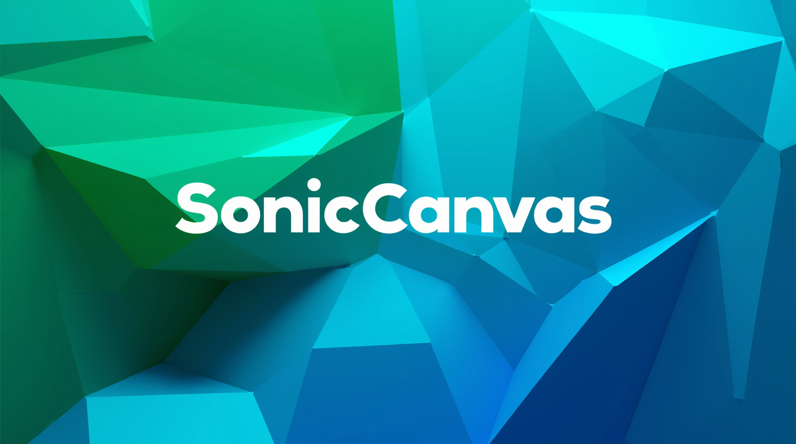

# SonicCanvas

**SonicCanvas** is an interactive web-based application that generates abstract visual art synchronized with music. By analyzing audio input (via microphone or file upload) for tempo, amplitude, and frequency, it creates dynamic visuals like swirling patterns, fractals, and particle bursts. Built with p5.js, Web Audio API, and GLSL shaders, it offers a customizable experience through a BASIC-like scripting interface.

  

## Project Idea
SonicCanvas was born from the vision of merging sound and sight into a unified artistic experience. Imagine a tool where DJs, musicians, or visual artists can transform live performances into mesmerizing projections, or where educators can teach audio-visual synesthesia through hands-on coding. The goal: create a playground for creativity where music doesn’t just play—it paints. With its draggable mini-window for projection previews and a retro scripting interface, SonicCanvas invites users to explore the infinite possibilities of sound-driven art.

## Features
- **Real-Time Audio Analysis**: Supports microphone input or audio file uploads, analyzing tempo, amplitude, and frequency.
- **Dynamic Visuals**: Generates swirling patterns, fractals, pulsing effects, and particle bursts driven by music.
- **Projection Preview**: Displays art in a draggable, resizable mini-window for output simulation.
- **Shader Effects**: Uses GLSL shaders for advanced, colorful visual enhancements.
- **Scripting Interface**: Customize animations with a notepad-style editor using simple commands (e.g., `COLOR`, `GOTO`, `EXPLODE`).
- **User Controls**: Adjust particle size, swirl intensity, and toggle audio sources via an intuitive UI.

## Demo
Check out the live demo on [GitHub Pages](https://frangedev.github.io/SonicCanvas/)

## Installation
1. **Clone the Repository**:
   ```bash
   git clone https://github.com/frangedev/SonicCanvas.git
   cd SonicCanvas
   ```
2. **Serve Locally**:
   - Use a local server (e.g., VS Code Live Server, or Python’s HTTP server):
     ```bash
     python -m http.server 8000
     ```
   - Open `http://localhost:8000` in your browser.
3. **Deploy to GitHub Pages** (optional):
   - Push to your GitHub repo.
   - Enable GitHub Pages in repo settings (branch: `main`, root directory).

## Usage
1. **Launch the App**:
   - Open `index.html` in a modern browser (Chrome/Firefox recommended for Web Audio API support).
2. **Audio Input**:
   - Check "Use Microphone" for real-time mic input (grant permission).
   - Or upload an audio file (e.g., MP3, WAV) via the file input.
3. **Adjust Controls**:
   - Use sliders for particle size and swirl intensity.
   - Monitor detected tempo in BPM.
4. **Script Animations**:
   - Edit the script in the notepad (see commands below).
   - Click "Run Script" to apply your animation sequence.
5. **Projection Preview**:
   - Drag the mini-window by its header or resize it via the bottom-right handle.

## Script Commands
Design animations using a BASIC-like syntax with line numbers. Commands execute sequentially unless modified by `GOTO` or `STOP`.

| Command         | Description                              | Example            |
|-----------------|------------------------------------------|--------------------|
| `COLOR <value>` | Sets particle hue (RED, GREEN, BLUE, RANDOM, or 0–360) | `10 COLOR RED`     |
| `SIZE <value>`  | Sets particle size (5–50)               | `20 SIZE 25`       |
| `SWIRL <value>` | Sets swirl intensity (0–1)              | `30 SWIRL 0.5`     |
| `SPEED <value>` | Adjusts animation speed (0.1–5.0)       | `40 SPEED 2.0`     |
| `PATTERN <value>` | Sets visual pattern (SWIRL, FRACTAL, PULSE, BURST) | `50 PATTERN FRACTAL` |
| `SPAWN <value>` | Sets particle spawn rate (1–50)         | `60 SPAWN 20`      |
| `PULSE <value>` | Sets pulsing intensity for PULSE pattern (0–10) | `70 PULSE 5`   |
| `ROTATE <value>`| Rotates particle velocities (degrees)   | `80 ROTATE 90`     |
| `FADE <value>`  | Reduces particle lifespans (1–255)      | `90 FADE 10`       |
| `EXPLODE <value>` | Multiplies particle velocities (0.1–5.0) | `100 EXPLODE 2.0` |
| `GOTO <line>`   | Jumps to specified line number          | `110 GOTO 10`      |
| `STOP`          | Halts script execution                  | `120 STOP`         |

### Example Script
```plaintext
10 COLOR RED
20 SIZE 25
30 SWIRL 0.3
40 SPEED 1.5
50 PATTERN PULSE
60 SPAWN 15
70 PULSE 3
80 ROTATE 45
90 FADE 5
100 EXPLODE 1.2
110 GOTO 10
```

## Technologies
- **p5.js**: Canvas rendering and sound processing.
- **Web Audio API**: Real-time audio analysis via p5.sound.
- **GLSL Shaders**: Advanced visual effects.
- **HTML/CSS/JavaScript**: UI and interactivity.

## Contributing
1. Fork the repo.
2. Create a feature branch (`git checkout -b feature-name`).
3. Commit changes (`git commit -m "Add feature"`).
4. Push to your fork (`git push origin feature-name`).
5. Open a Pull Request.

Suggestions for enhancements:
- Add more shader effects (e.g., noise-based fractals).
- Improve tempo detection accuracy.
- Support additional audio features (e.g., pitch detection).

## License
This project is licensed under the MIT License - see [LICENSE](LICENSE) for details.

## Credits
Developed by FRANGE with ❤️ and 🎶.
